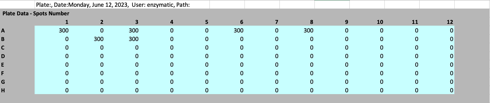

# ACE Configurator for ELISpot

`ACE` generates ELISpot configurations and identifies (deconvolves) hit peptides 
from ELISpot results.

Described below is a quick tutorial on `ACE`. For detailed documentation, 
please refer to our [official documentation](https://pirl-unc.github.io/ace/). 

## 01. Installation

Download the latest stable release version from [here](https://github.com/pirl-unc/ace/releases)
```
pip install ace-<version>.tar.gz
```

## 02. Dependencies

- [golfy](https://github.com/pirl-unc/golfy)
- [ortools>= 9.3.10497](https://developers.google.com/optimization/install)
- torch
- transformers>=4.30.2
- pandas
- openpyxl

## 03. Usage

```
usage: ace [-h] [--version] {generate,identify,verify} ...

ACE Configurator for ELISpot.

positional arguments:
  {generate,identify,verify}
                        ACE sub-commands.
    generate            Generates an ELIspot experiment configuration.
    identify            Identify hit peptide IDs given read-outs from an ELIspot experiment.
    verify              Verifies whether an ELIspot configuration satisfies all ACE constraints.

optional arguments:
  -h, --help            show this help message and exit
  --version, -v         show program's version number and exit
```

### 03-1. Generate an ELISpot configuration

In the example below, you want to generate an ELISpot configuration that 
pools 10 peptides per pool (i.e. well) for a total of 100 unique peptides. 
You also want to repeat each peptide 3 times (i.e. 3x coverage); each peptide 
will appear in 3 different pools.

```shell
ace generate \
  --num-peptides 100 \
  --num-peptides-per-pool 10 \
  --num-coverage 3 \
  --num-processes 2 \
  --output-csv-file 100peptides_10perpool_3x.csv \
  --assign-well-ids 1 \
  --plate-type 96-well_plate
```

The output CSV file [100peptides_10perpool_3x.csv]() has the following columns:

| coverage_id | pool_id | peptide_id  | plate_id | well_id |
|-------------|---------|-------------|----------|---------|
| coverage_1  | pool_1  | peptide_1   | 1        | A1      |
| ...         | ...     | ...         | ...      | ...     |
| coverage_3  | pool_30 | peptide_100 | 1 | B12     |

Please note that we have generated several ELISpot configurations that are readily 
available for download [here]().

### 03-2. Identify (deconvolve) hit peptides

Let's say you have successfully run an ELISpot experiment with the above configuration 
(`100peptides_10perpool_3x.csv`). Now you want to identify (deconvolve) hit 
peptides. Here we describe how you can achieve this using `ACE`.

#### AID Plate Reader

If you used a plate reader from AID, we are able to automatically parse the `xlsx` file from 
the machine.

`elispot_results.xlsx`:



Identify (deconvolve) hit peptides from your ELISpot experiment:

```shell
ace identify \
  --readout-file-type aid_plate_reader \
  --readout-files /path/elispot_results.xlsx \
  --configuration-csv-file /path/100peptides_10perpool_3x.csv \
  --min-positive-spot-count 300 \
  --output-csv-file ace_deconvolution_results.csv
```

#### Any Reader

You can alternatively supply a generic ELISpot results `csv` file to `ACE`:

`elispot_results.csv`:

| pool_id | spot_count |
| ------- | ---------- |
| pool_1 | 300 |
| ... | ... |
| pool_30 | 0 |

Identify (deconvolve) hit peptides from your ELISpot experiment:

```shell
ace identify \
  --readout-file-type pool_id \
  --readout-files /path/elispot_results.csv \
  --configuration-csv-file /path/100peptides_10perpool_3x.csv \
  --min-positive-spot-count 300 \
  --output-csv-file ace_deconvolution_results.csv
```

### Deconvolution results

Here is what `ACE` deconvolution results look like:

| peptide_id | pool_ids | num_coverage | deconvolution_result |
|------------| -------- |-------------|----------------------|
 peptide_7  | pool_5;pool_9;pool_13 | 3 | hit                  |
| ...        | ... | ...         | ...                  |
| peptide_9  | pool_1;pool_9;pool_14 | 3           | candidate_hit        |

`ACE` deconvolution identifies two classes of peptides: `candidate_hit` and `hit`. 
Peptides that have the label `hit` are confident hits (assuming no false positives) 
because they were present in `num_coverage` (i.e. 3 in the above configuration) 
number of different pools with at least one unique assignment of hit peptide-pool. 
On the other hand, peptides that have the label `candidate_hit` need further 
validation (i.e. a second round of ELISpot) to determine whether it is indeed a 
hit peptide.

